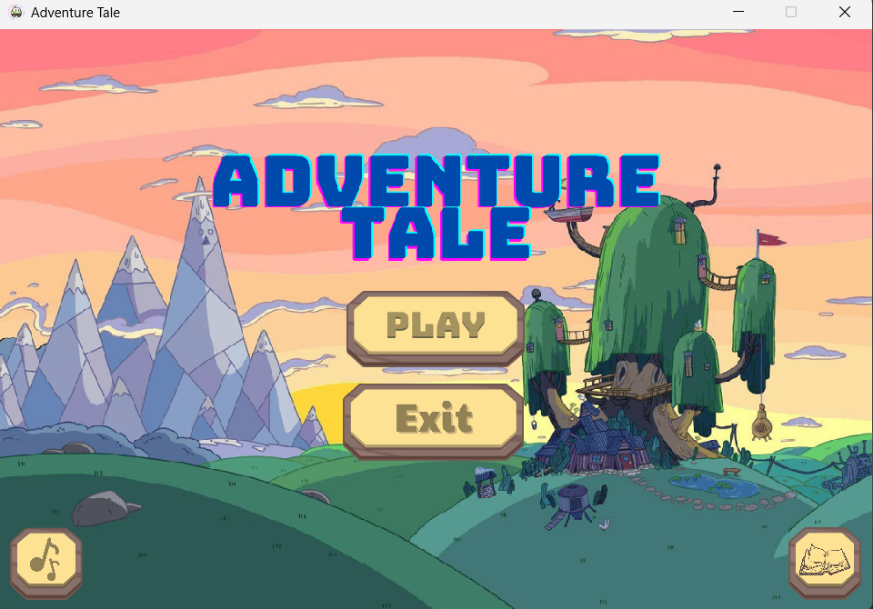
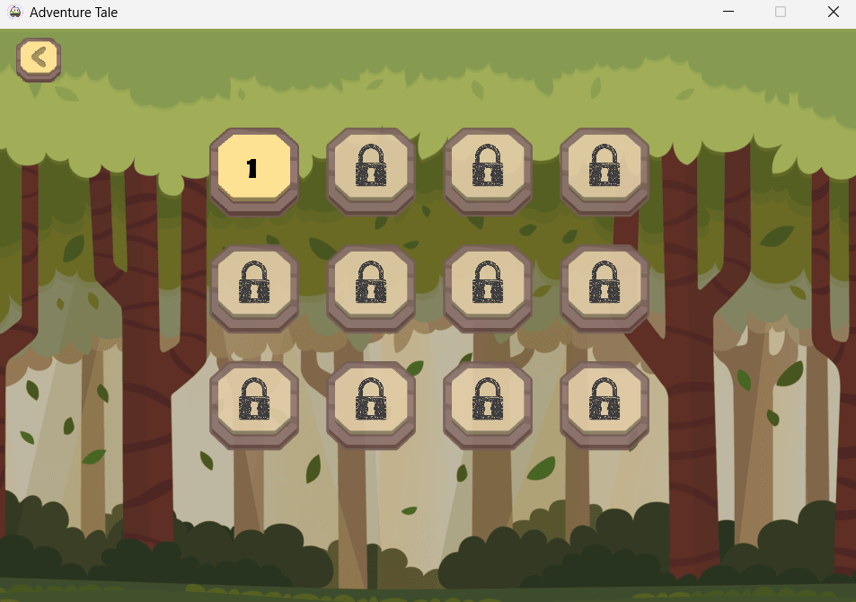
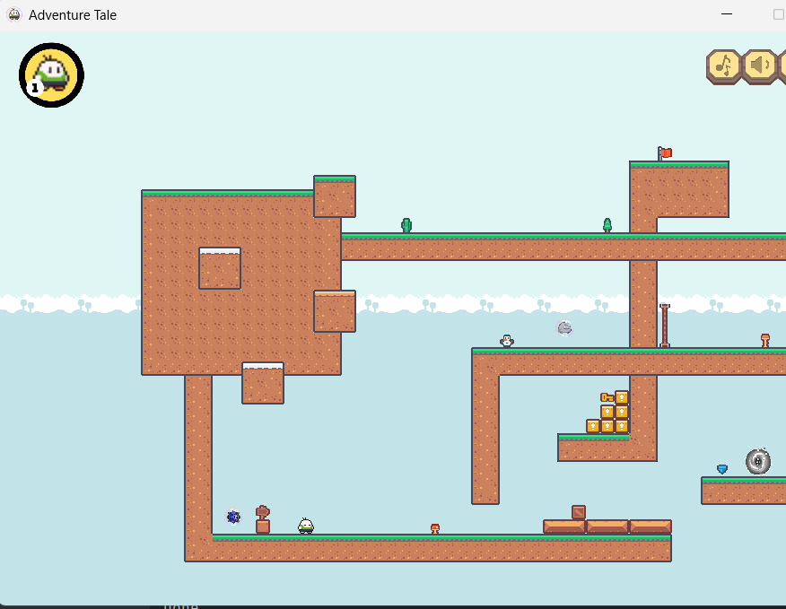
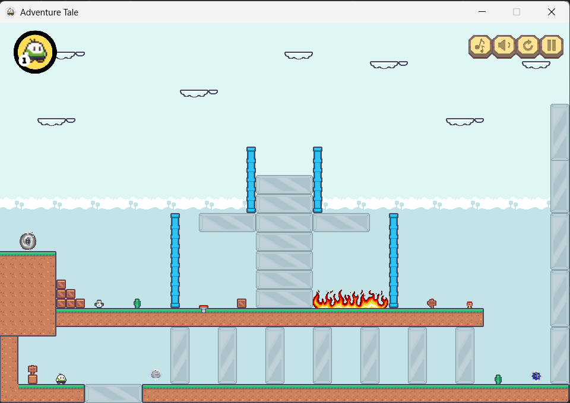

## 1. Thông Tin Nhóm

**Tên Dự Án:** [PGJ-Adventure-Tale]

**Link Dự Án:** [GitHub Link](https://github.com/NguyenBui256/PGJ-Adventure-Tale)

**Thành Viên Nhóm:**
- [Đỗ Lý Minh Anh](https://github.com/minhengdey)
- [Nguyễn Thị Như Quỳnh](https://github.com/milometqua)
- [Bùi Thế Vĩnh Nguyên](https://github.com/NguyenBui256)
- Mentor: [Nguyễn Quốc Hưng](https://github.com/quochung-cyou)


### Mô hình làm việc

Team hoạt động theo mô hình Scrum, sử dụng Linear để quản lý công việc. Các công việc được keep track đầy đủ trên Linear.
- [Linear Link](https://linear.app/bdtproptit/team/NHOM8/all)

Mỗi tuần, team sẽ ngồi lại để review công việc đã làm, cùng nhau giải quyết vấn đề và đề xuất giải pháp cho tuần tiếp theo. Sau đó sẽ có buổi demo cho mentor để nhận phản hồi và hướng dẫn.

### Version Control Strategy


Team hoạt động theo Gitflow để quản lý code. Mỗi thành viên sẽ tạo branch từ `develop` để làm việc, các branch đặt theo format `feature/ten-chuc-nang`, sau khi hoàn thành sẽ tạo Pull Request để review code và merge vào develop
- Các nhánh chính:
  - `master`: Chứa code ổn định, đã qua kiểm tra và test kỹ lưỡng
  - `develop`: Chứa code mới nhất, đã qua review và test
  - `feature/`: Các nhánh chứa code đang phát triển, short-live, sau khi hoàn thành sẽ merge vào `develop`. 


Sau mỗi tuần, team sẽ merge `develop` vào `master` để release phiên bản mới.


## 2. Giới Thiệu Dự Án

**Mô tả:**
- Game 2D trí tuệ, vượt ải trên nền tảng desktop.
- Chủ đề về thiên nhiên, sinh vật.
- Người chơi thu thập các nhân vật có các chức năng đặc thù để vượt qua các địa hình hiểm trở.

## 3. Các Chức Năng Chính

- Chơi game, thoát game, hướng dẫn game.
- Bật tắt âm thanh nhạc nền, tiếng nhân vật.
- Vào / ra các màn chơi, lưu tiến trình chơi.
- Di chuyển, biến hình, các nhân vật có chức năng riêng biệt.
- Zoom camera xem toàn cảnh map.
- Restart màn chơi, pause màn chơi, hiển thị thông báo khi chiến thắng / dừng màn chơi.

## 4. Công nghệ

### 4.1. Công Nghệ Sử Dụng
- Java 8
- Thư viện đồ họa LibGDX.
- Gradle.
- Canva thiết kế.
- Phần mềm vẽ pixel: Aseprite

### 4.2 Cấu trúc dự án

```
- assets 
  - font
  - sounds
  - tileset
- core
  - src
    - game
      - MenuScreen.java
      - LevelScreen.java
      - GameScreen.java
      - TransitionScreen.java
      - Menu.java
      - Hud.java
      - Main.java
    - helper
      - BodyHelperService.java
      - Constants.java
      - TileMapHelper.java
      - WorldContactListener.java
      - DrawText.java
    - objects
      - box
        - Bubble.java
        - Box.java
        - Button.java
        - Door.java
        - Fire.java
        - Glass.java
      - player
        - Character.java
        - Player.java
- desktop
```

Diễn giải:
- **assets:** Chứa các tài nguyên như hình ảnh, âm thanh
- **core:** Chứa các class chính của game.
- **desktop** Chứa các class để chạy trên các nền tảng desktop.


## 5. Ảnh và Video Demo

**Ảnh Demo:**







**Video Demo:**
[Video Link](https://www.youtube.com/watch?v=4SE8XSRuOIM)


## 6. Các Vấn Đề Gặp Phải

### Vấn Đề 1: Logic nhân vật
**Mô tả:** 
- Logic nhân vật chưa được xử lí chặt chẽ, thi thoảng còn gặp bug khi di chuyển trong địa hình (đặc biệt là nhân vật Bạch Tuộc - dính tường).

- Ban đầu định làm hướng set tọa độ ảnh nhưng không khả thi.

**Giải pháp:** Sử dụng 8 sensors ở 4 cạnh và 4 đỉnh của body nhân vật.
- Thiết kế các phần địa hình trong map cho phù hợp.

**Kết quả:**

- Sau khi sử dụng các sensors để kiểm tra điều kiện cho nhân vật, đã có thể di chuyển cơ bản quanh các địa hình, tuy nhiên đôi khi vẫn xảy ra bug khi gặp các địa hình giao nhau, góc cạnh, phức tạp hơn.

### Vấn Đề 2: Hiệu năng
**Mô tả:**
- Game sử dụng khá nhiều bộ nhớ, do các Texture chưa được sử dụng hợp lí, còn lặp lại ở nhiều class, còn nhiều phần code chưa tối ưu.

**Giải pháp:** 
- Xem xét sử dụng các hàm callback để sử dụng / khai báo khi cần thiết, chứ không khai báo toàn bộ từ ban đầu.
- Lưu các đường dẫn, tài nguyên cần sử dụng nhiều lần vào các biến Constants thay vì các biến, tên đường dẫn bằng String thông thường.

**Kết quả:**

- Đã phần nào giải quyết được vấn đề sử dụng nhiều bộ nhớ, tuy nhiên chưa có số liệu cụ thể về độ cải thiện.

## 7. Kết Luận

**Kết quả đạt được:** 
- Game vận hành đủ tính năng theo dự tính, hiệu năng duy trì ổn định ở mức 60FPS.
- Đồ họa, âm thanh, giao diện người chơi UI/UX đã được bổ sung để game trở nên thu hút, dễ nhìn hơn.

**Hướng phát triển tiếp theo:** 
- Tiếp tục tối ưu các phần code, phần logic nhân vật để tăng hiệu năng.
- Cải thiện giao diện, đồ họa cho hài hòa.
- Thêm các tính năng tăng trải nghiệm người chơi: Video intro cốt truyện, animation động hướng dẫn người chơi, địa hình khó hơn, thêm nhân vật, thêm phần thưởng, ...
